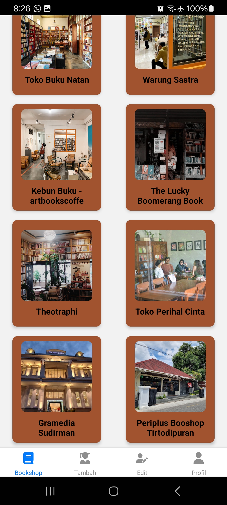
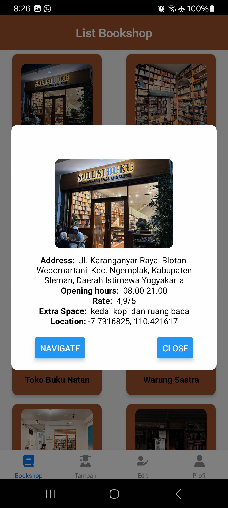

**AksaráLuna**  

AksaráLuna adalah aplikasi mobile yang dirancang khusus untuk pecinta buku di Jogja. Aplikasi ini memberikan rekomendasi 12 toko buku terbaik di Jogja, lengkap dengan informasi penting seperti foto, nama, alamat, jam operasional, rating, fasilitas yang tersedia, serta fitur navigasi. Dengan integrasi Google Maps, AksaraLuna membantu pengguna menemukan rute tercepat, estimasi waktu perjalanan, dan mempermudah eksplorasi toko buku favorit di sekitar Jogja. Data ditampilkan dalam format FlatList berbasis JSON untuk tampilan yang sederhana namun informatif.  

---

### **Komponen Pembangun Produk**  
1. **Frontend**:  
   - Framework: React Native  
   - Komponen utama: FlatList untuk menampilkan data toko buku.  
   - Reanimated: untuk animasi yang ditampilkan pada Onboarding Screen  

2. **Backend**:  
   - Data JSON berisi informasi toko buku.  
   - Integrasi API Google Maps untuk navigasi dan estimasi waktu.  

3. **Fitur Utama**:  
   - Daftar toko buku: foto, nama, alamat, jam operasional, rating, fasilitas.  
   - Navigasi berbasis peta: rute tercepat dan estimasi waktu perjalanan.  

4. **Desain Antarmuka**:  
   - Desain minimalis untuk pengalaman pengguna yang optimal.  
   - Header dengan nama aplikasi, dan pencarian rute langsung melalui Google Maps.  

5. **Platform Pendukung**:  
   - Android dan iOS.  

---

### **Sumber Data**  
1. **Informasi Toko Buku**:  
   - Data diambil dan disimpan dalam format JSON (disusun secara manual atau diambil dari sumber resmi toko buku).  

2. **Navigasi**:  
   - API Google Maps untuk pencarian rute, estimasi waktu, dan tampilan peta.  

3. **Rating dan Fasilitas**:  
   - Berasal dari review pengguna di Google Maps  

---

### **Tampilan Produk**  

  
  
  
  

